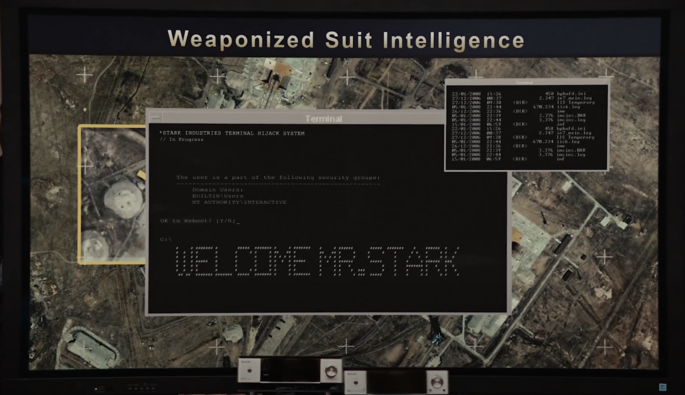

# Welcome Mr Stark

## Motivation

[This scene](https://youtu.be/f6xoS2wGAts?t=163) from [Iron Man 2](https://www.imdb.com/title/tt1228705)

## Related "techy" stuff

- Converting an image or text into ascii image

Not hard. I can potentially manually draw this on grid paper and generate the string on the go. 

But there are existing tools for such purpose, for instance: [text-image.com](https://www.text-image.com/convert/ascii.html)

- Executing some shell scripts that will print out the strings at log in time.

Depending on the system configuraiton, I think there are multiple possible scenarios:

    - ssh login message. For Ubuntu this can be configured via /etc/update-motd.d

    - zsh login message. If I append the code at the end of my ~/.zshrc I think this will get executed for every zsh session I open (even under tmux)
