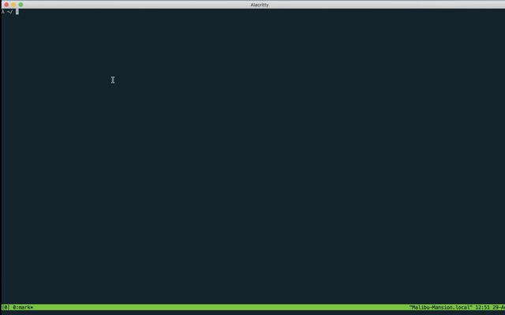

# Welcome Mr Stark

## Motivation

[This scene](https://youtu.be/f6xoS2wGAts?t=163) from [Iron Man 2](https://www.imdb.com/title/tt1228705)

## Related "techy" stuff

- Converting an image or text into ascii image

    Not hard. I can potentially manually draw this on grid paper and generate the string on the go. 

    But there are existing tools for such purpose, for instance: [text-image.com](https://www.text-image.com/convert/ascii.html)

- Executing some shell scripts that will print out the strings at log in time.

    Depending on the system configuraiton, I think there are multiple possible scenarios:

    * ssh login message. For Ubuntu this can be configured via /etc/update-motd.d

    * zsh login message. If I append the code at the end of my ~/.zshrc I think this will get executed for every zsh session I open (even under tmux)

## Process

1. Creating the text in Power Point. The font looks kind of like Courier New (?). Saving the text box to png file.

2. Tyring a bunch of online converter, didn't really work out well

3. Resizing the image to (32, 160) and saving only the last channel (the saved png from Power Point has 4 channels)

4. Writing a simple loop to convert the image to a text file

5. Writing another simple loop to generate bash scripts that can print the text file to terminal

   Note: I chose to remove the last line in the generated text file for better visual results.

6. Appended the generated bash script to my ~/.zshrc. Also added some sleep statement before; otherwise, it looked kinda boring...

Possible improvement:

- Better image to start with 

- Better resizing (interpolation etc)

## Scripts

* naive\_convert.py, for step 3 and 4 mentioned above

* compile\_bash\_commands.py, for step 5 mentioned above

## Demo

